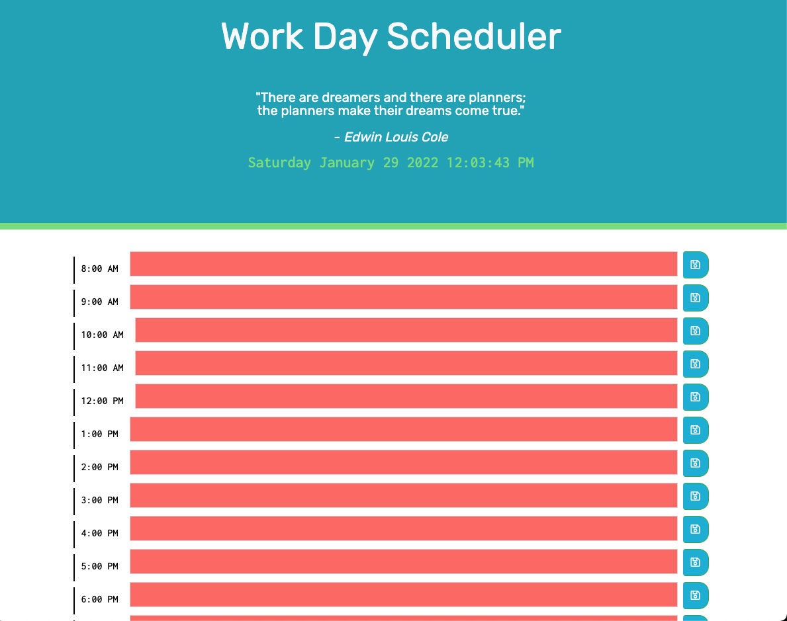

# Work Day Scheduler

The goal of this project was to create a scheduler for working individuals to help keep then on track to reaching their goals throughout their busy day.

## Challenge Goals

- Create a daily planner to create a schedule.
- When the user opens the planner, the current date and time is displayed at the top of the calendar.
- The user is then presented with time blocks for standard business hours.
- The time blocks for that day each time block is color-coded to indicate whether it is in the past, present, or future.
- When the user clicks into a time block they can enter an event and click the save button for that time block.
- The user's text for that event is saved in local storage
- When the user refreshes the page then the saved events persist

## Visit Scheduler Here:

- https://saraoros.github.io/work-day-scheduler/

